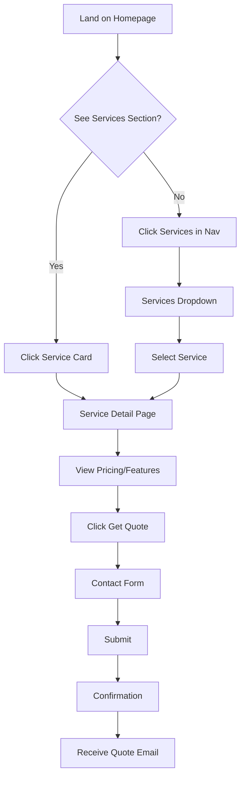
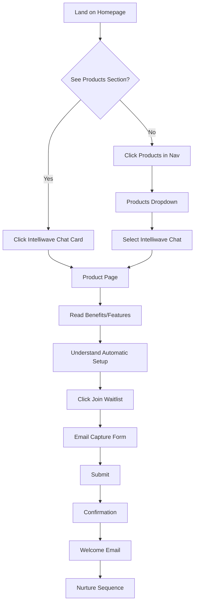
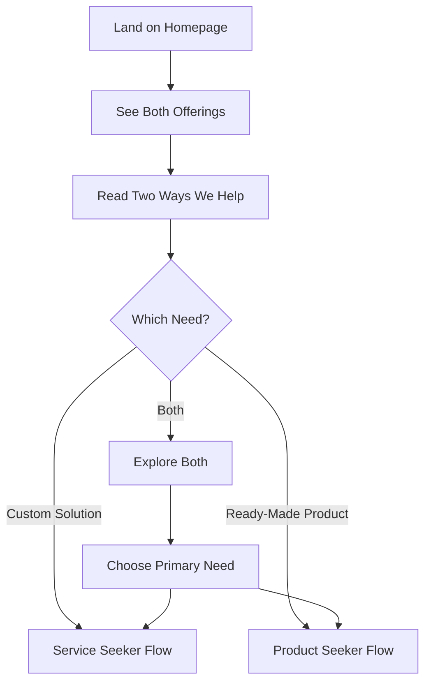

# Intelliwave Website Information Architecture - UX Design Specification

_Created on January 27, 2025 by Hamza_  
_Generated using BMad Method - Create UX Design Workflow_

---

## Executive Summary

This UX design specification addresses the information architecture challenge of adding Intelliwave Chat (a SaaS product) alongside existing web development services on www.intelliwave.co. The goal is to create clear separation between Services and Products while maintaining a unified brand experience, ensuring both offerings are easily discoverable and conversion-optimized.

**Key Challenge:** Balance two distinct business models (project-based services vs. subscription products) with different target audiences (UK businesses vs. Shopify store owners) in a way that doesn't confuse users but leverages the unified brand.

**Solution Approach:** Hybrid information architecture with clear visual and navigational separation, balanced homepage prominence, and optimized user flows for both service seekers and product seekers.

---

## 1. Project Understanding

### 1.1 Project Vision

**What we're building:**
A website that successfully presents both custom web development services AND a SaaS product (Intelliwave Chat) without confusion, allowing users to quickly find what they need while maintaining a cohesive brand experience.

**Core Experience:**
The defining experience is **"Quick Discovery and Clear Choice"** - users should immediately understand:
1. What Intelliwave offers (Services vs Products)
2. Which offering is for them
3. How to take the next step (contact for services OR join waitlist for product)

**Platform:**
Web application (responsive, mobile-first) - existing React/TypeScript site

**Target Users:**
- **Service Seekers:** UK businesses needing custom web development (one-time projects)
- **Product Seekers:** Shopify store owners needing AI customer support (subscription)
- **Hybrid Users:** Businesses that might need both (should understand the difference)

### 1.2 Desired Emotional Response

Users should feel:
- **Confident** - Clear understanding of what's available
- **Efficient** - Can quickly find what they need
- **Trusted** - Professional, organized, credible
- **Empowered** - Clear path to next action

---

## 2. Information Architecture Design

### 2.1 Navigation Structure

#### Desktop Navigation

**Primary Navigation Bar:**
```
[Logo]  Services ▼  Products ▼  Portfolio  Pricing  About  Contact  [Get Started]
```

**Services Dropdown:**
- Custom Web Development
- Custom Web Applications
- E-commerce Solutions
- View All Services →

**Products Dropdown:**
- Intelliwave Chat ⭐ (Featured, with badge)
- [Future: Intelliwave Lens]
- [Future: Intelliwave Mini-CRM]
- View All Products →

**Visual Distinction:**
- Services: Blue accent color, briefcase/briefcase icon
- Products: Purple accent color, sparkles/rocket icon
- Both use same typography and spacing for consistency

#### Mobile Navigation

**Pattern:** Hamburger menu with accordion-style expansion

**Structure:**
```
[☰ Menu]
  ├─ Services ▼
  │   ├─ Custom Web Development
  │   ├─ Custom Web Applications
  │   └─ E-commerce Solutions
  ├─ Products ▼
  │   └─ Intelliwave Chat ⭐
  ├─ Portfolio
  ├─ Pricing
  ├─ About
  └─ Contact
```

**Mobile Considerations:**
- Touch targets: Minimum 44x44px
- Clear visual separation between Services and Products sections
- Sticky header with hamburger icon
- Smooth accordion animations

### 2.2 Homepage Layout

#### Recommended Section Order

1. **Hero Section** (Balanced Approach)
   - Headline: "Custom Development + Intelligence Products"
   - Subheadline: "Build unique solutions or use ready-made products that grow with you"
   - Dual CTAs: "View Services" (primary) | "See Products" (secondary)
   - Visual: Split screen or side-by-side imagery representing both

2. **"Two Ways We Help" Section** (New)
   - Split layout: Left = Services, Right = Products
   - Clear comparison table or cards
   - Helps users understand the difference
   - CTAs for each path

3. **Products Section** (Prominent)
   - Intelliwave Chat featured card
   - Key benefits: Automatic setup, Shopify-native, affordable
   - CTA: "Join Waitlist - Get 50% Off"
   - Visual: Product mockup or screenshot

4. **Services Section** (Streamlined)
   - 3 service cards (current services)
   - Less visual weight than products section
   - CTA: "Get Quote" or "View All Services"
   - Link to full services page

5. **Portfolio Section** (Keep)
   - Shows capability for both
   - Filter: "Services" | "Products" | "All"

6. **Testimonials** (Keep)
   - Mix of service and product testimonials
   - Clear labels indicating which offering

7. **About Section** (Updated)
   - Story: "From Custom Solutions to Intelligence Products"
   - Explains the evolution

8. **Contact Section** (Keep)
   - Dual CTAs: "Get Quote" (services) | "Join Waitlist" (products)

#### Alternative: Product-Focused Hero (For Testing)

**Option B:**
- Headline: "AI Customer Support That Sets Up Automatically"
- Subheadline: "For Shopify stores. Zero setup. Affordable pricing."
- Primary CTA: "Join Waitlist - Get 50% Off"
- Secondary: "Or explore our custom development services"
- Visual: Intelliwave Chat product showcase

**Recommendation:** Start with balanced approach (Option A), A/B test Option B

### 2.3 Visual Separation Strategy

#### Color Coding
- **Services:** Primary brand blue (#2563eb) with blue accent
- **Products:** Purple accent (#9333ea) to differentiate
- **Shared:** Neutral grays for common elements

#### Typography
- **Services:** Slightly bolder headings, professional tone
- **Products:** Slightly more modern, friendly tone
- **Shared:** Same font family, different weights/styles

#### Icons
- **Services:** Briefcase, tools, code icons
- **Products:** Sparkles, rocket, AI/brain icons
- **Shared:** Consistent icon style library

#### Visual Treatment
- **Services:** More structured, grid-based layouts
- **Products:** More fluid, card-based layouts
- **Shared:** Same spacing system, border radius, shadows

### 2.4 User Flow Diagrams

#### Service Seeker Flow



#### Product Seeker Flow



#### Hybrid User Flow



---

## 3. Component Design Specifications

### 3.1 Navigation Components

#### Desktop Dropdown Menu

**Services Dropdown:**
- Trigger: "Services" text with chevron icon
- Hover/Click: Opens dropdown
- Content: Service list with icons
- Visual: Blue accent border on hover
- Position: Below trigger, left-aligned

**Products Dropdown:**
- Trigger: "Products" text with chevron icon
- Hover/Click: Opens dropdown
- Content: Product list with featured badge
- Visual: Purple accent border on hover
- Position: Below trigger, left-aligned

**States:**
- Default: Text color muted
- Hover: Text color primary, dropdown opens
- Active: Text color primary, underline
- Mobile: Accordion expansion

#### Mobile Hamburger Menu

**Trigger:**
- Icon: Three horizontal lines (hamburger)
- Position: Right side of header
- Size: 44x44px touch target

**Menu Panel:**
- Full-screen overlay or slide-in from right
- Dark overlay on background
- Close button (X) in top-right
- Smooth animation (300ms ease)

**Accordion Behavior:**
- Services/Products sections expandable
- Chevron rotates on expand
- Smooth height transition
- Touch-friendly targets

### 3.2 Homepage Sections

#### Hero Section

**Layout Options:**

**Option A: Split Hero**
- Left: Services messaging + CTA
- Right: Products messaging + CTA
- Visual divider (subtle line or gradient)
- Responsive: Stacks on mobile

**Option B: Centered Hero**
- Single headline mentioning both
- Two CTAs side-by-side
- Background: Gradient or video
- Responsive: CTAs stack on mobile

**Option C: Tabbed Hero**
- Tabs: "Services" | "Products"
- Content switches based on tab
- Single CTA updates per tab
- Responsive: Tabs become dropdown

**Recommendation:** Option A (Split Hero) for clear separation

#### "Two Ways We Help" Section

**Layout:**
- Two-column grid (desktop)
- Side-by-side comparison cards
- Visual: Icons or illustrations
- CTAs: One per card

**Content:**
- Left Card: Services
  - Title: "Custom Solutions"
  - Subtitle: "For Unique Needs"
  - Benefits: Bullet points
  - CTA: "View Services"
  
- Right Card: Products
  - Title: "Intelligence Products"
  - Subtitle: "For Common Needs"
  - Benefits: Bullet points
  - CTA: "See Products"

**Visual Treatment:**
- Different background colors (subtle)
- Matching card heights
- Consistent spacing
- Hover effects

#### Products Section (Intelliwave Chat)

**Layout:**
- Featured product card (large)
- Background: Gradient or colored section
- Visual: Product mockup/screenshot
- Content: Benefits, pricing preview, CTA

**Card Components:**
- Badge: "New" or "Coming Soon"
- Headline: "Intelliwave Chat"
- Subheadline: "AI Customer Support That Sets Up Automatically"
- Key Benefits: 3-4 bullet points
- Pricing Preview: "$49-199/month"
- CTA: "Join Waitlist - Get 50% Off"
- Secondary: "Learn More" link

**Visual Treatment:**
- Prominent placement
- Eye-catching but not overwhelming
- Clear Shopify-specific messaging
- Trust signals (badges, guarantees)

#### Services Section (Streamlined)

**Layout:**
- Three-column grid (desktop)
- Service cards (smaller than products)
- Less visual weight
- Link to full services page

**Card Components:**
- Icon
- Title
- Price range
- Brief description
- CTA: "Learn More"

**Visual Treatment:**
- Subtle borders
- Less prominent colors
- Consistent with brand but less emphasis
- Hover: Slight elevation

### 3.3 Form Components

#### Contact Form (Services)

**Fields:**
- Name (required)
- Email (required)
- Company (optional)
- Project Type (dropdown)
- Message (required)
- Budget Range (optional)

**Validation:**
- Real-time validation on blur
- Error messages inline
- Success: Thank you message + email

#### Waitlist Form (Products)

**Fields:**
- Email (required)
- Store Name (optional)
- Store URL (optional)
- Number of Products (optional)

**Validation:**
- Email format validation
- Real-time feedback
- Success: Confirmation + welcome email

**Incentive Display:**
- "Get 50% off first 3 months"
- "Join 500+ Shopify stores"
- Trust badges

---

## 4. Responsive Design Strategy

### 4.1 Breakpoint Strategy

**Breakpoints:**
- Mobile: 0-767px (single column, hamburger menu)
- Tablet: 768-1023px (2 columns, simplified nav)
- Desktop: 1024px+ (full layout, dropdown nav)

### 4.2 Layout Adaptations

#### Navigation
- **Mobile:** Hamburger menu, full-screen overlay
- **Tablet:** Simplified nav, some dropdowns
- **Desktop:** Full dropdown navigation

#### Hero Section
- **Mobile:** Stacked layout, single column
- **Tablet:** Reduced spacing, smaller text
- **Desktop:** Full split or centered layout

#### Two Ways We Help
- **Mobile:** Stacked cards, full width
- **Tablet:** Side-by-side, smaller cards
- **Desktop:** Full two-column layout

#### Products/Services Sections
- **Mobile:** Single column, stacked cards
- **Tablet:** 2 columns for cards
- **Desktop:** 3 columns for services, featured product

### 4.3 Touch Optimization

**Touch Targets:**
- Minimum: 44x44px
- Preferred: 48x48px for primary actions
- Spacing: 8px minimum between targets

**Gestures:**
- Swipe: Not required (standard scrolling)
- Tap: Primary interaction
- Long press: Not used

---

## 5. Accessibility Strategy

### 5.1 WCAG Compliance

**Target Level:** WCAG 2.1 Level AA

**Key Requirements:**
- Color contrast: 4.5:1 for text, 3:1 for UI components
- Keyboard navigation: All interactive elements accessible
- Focus indicators: Visible on all focusable elements
- ARIA labels: Meaningful labels for screen readers
- Alt text: Descriptive for all meaningful images
- Form labels: Proper label associations
- Error identification: Clear, descriptive error messages

### 5.2 Keyboard Navigation

**Navigation Order:**
1. Skip to main content link
2. Logo (home)
3. Services dropdown
4. Products dropdown
5. Portfolio
6. Pricing
7. About
8. Contact
9. Get Started button
10. Main content

**Dropdown Behavior:**
- Enter/Space: Open dropdown
- Arrow keys: Navigate items
- Escape: Close dropdown
- Tab: Move to next item

### 5.3 Screen Reader Support

**ARIA Labels:**
- Navigation: `aria-label="Main navigation"`
- Services dropdown: `aria-label="Services menu"`
- Products dropdown: `aria-label="Products menu"`
- CTAs: Descriptive `aria-label` attributes
- Forms: Proper `aria-describedby` for errors

**Semantic HTML:**
- Proper heading hierarchy (h1-h6)
- Landmark regions (nav, main, footer)
- Form fields with labels
- Button vs link distinction

---

## 6. UX Pattern Decisions

### 6.1 Button Hierarchy

**Primary Actions:**
- Style: Solid background, high contrast
- Usage: Main conversion actions
- Examples: "Join Waitlist", "Get Quote", "Get Started"

**Secondary Actions:**
- Style: Outlined or ghost button
- Usage: Alternative actions
- Examples: "Learn More", "View All Services"

**Tertiary Actions:**
- Style: Text link
- Usage: Less important actions
- Examples: "Read case study", "View pricing"

**Destructive Actions:**
- Style: Red/destructive color
- Usage: Delete, remove actions
- Examples: Not applicable for this site

### 6.2 Feedback Patterns

**Success:**
- Pattern: Toast notification (top-right)
- Duration: 5 seconds auto-dismiss
- Content: Clear success message + action taken

**Error:**
- Pattern: Inline (forms) + Toast (general)
- Timing: On submit (forms), immediate (general)
- Content: Specific error message + how to fix

**Loading:**
- Pattern: Skeleton screens (content) + Spinner (actions)
- Usage: Skeleton for page loads, spinner for button actions

**Warning:**
- Pattern: Inline banner or toast
- Usage: Important but non-blocking messages

### 6.3 Form Patterns

**Label Position:**
- Above input fields (better for mobile, clearer)

**Required Field Indicator:**
- Asterisk (*) + "Required" text in form header

**Validation Timing:**
- On blur (after user leaves field)
- On submit (final validation)

**Error Display:**
- Inline below field
- Red border on input
- Clear error message
- Icon indicator

**Help Text:**
- Tooltip for complex fields
- Caption text below field for guidance

### 6.4 Modal Patterns

**Size Variants:**
- Small: Alerts, confirmations
- Medium: Forms, content
- Large: Complex forms, detailed content

**Dismiss Behavior:**
- Click outside: Closes modal
- Escape key: Closes modal
- Close button: Always visible

**Focus Management:**
- Auto-focus: First input or close button
- Trap focus: Keep focus within modal
- Return focus: To trigger element on close

### 6.5 Navigation Patterns

**Active State:**
- Visual: Underline or background highlight
- Color: Primary brand color
- Indication: Clear but not overwhelming

**Breadcrumbs:**
- Usage: On service/product detail pages
- Format: Home > Services > Custom Web Development
- Style: Subtle, secondary text

**Back Button:**
- Browser back: Standard behavior
- In-app back: Not needed (standard navigation)

---

## 7. Implementation Recommendations

### 7.1 Phase 1: Foundation (Week 1)

**Priority:**
1. Update navigation structure
2. Create Intelliwave Chat product page
3. Add Products section to homepage
4. Update mobile navigation

**Deliverables:**
- Updated navigation component
- Product page template
- Homepage Products section
- Mobile menu component

### 7.2 Phase 2: Optimization (Week 2-3)

**Priority:**
1. Create "Two Ways We Help" section
2. Update hero section
3. Streamline Services section
4. Add visual separation elements

**Deliverables:**
- New homepage sections
- Updated hero component
- Visual distinction system
- A/B test setup

### 7.3 Phase 3: Refinement (Week 4+)

**Priority:**
1. User testing
2. A/B testing hero variations
3. Analytics setup
4. Performance optimization

**Deliverables:**
- Test results
- Optimization recommendations
- Analytics dashboard
- Performance improvements

---

## 8. Success Metrics

### 8.1 Usability Metrics

- **Navigation Usage:** Track clicks on Services vs Products
- **Time to Find:** Average time to reach target page
- **Bounce Rate:** By user type (service vs product seeker)
- **Conversion Rate:** Services (contact form) vs Products (waitlist)

### 8.2 Business Metrics

- **Service Inquiries:** Maintain or increase
- **Waitlist Signups:** Target 100+ in first month
- **Page Views:** Product page vs service pages
- **Revenue:** Track both streams

### 8.3 Technical Metrics

- **Page Load Time:** < 3 seconds
- **Mobile Performance:** Core Web Vitals scores
- **Accessibility Score:** WCAG AA compliance
- **SEO:** Maintain rankings, improve product pages

---

## 9. Next Steps

### Immediate Actions

1. **Review this specification** with team
2. **Prioritize implementation** based on business goals
3. **Create component library** for new elements
4. **Set up analytics** to track metrics

### Design Refinement

1. **Create high-fidelity mockups** for key screens
2. **User testing** with target audiences
3. **Iterate based on feedback**
4. **A/B test variations**

### Development

1. **Implement navigation updates**
2. **Build product page**
3. **Update homepage sections**
4. **Mobile optimization**
5. **Accessibility audit**

---

**This specification provides the foundation for implementing a clear, user-friendly information architecture that successfully presents both Services and Products while maintaining brand unity and optimizing for conversions.**

